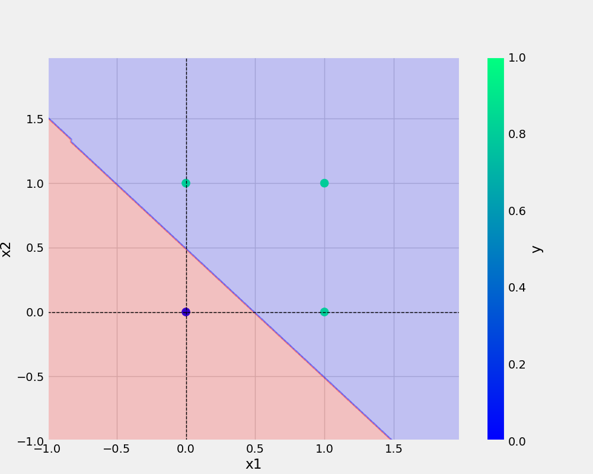

# Perceptron
```

author: Tharun
email: tharunsd23@gmail.com

```
## Python
``` Python
def main(data,eta, epochs,filename):

    df= pd.DataFrame(data)
    print(df)

    X,y = prepare_data(df)
   

    model = Perceptron(eta,epochs)
    model.fit(X,y)
    _= model.total_loss()

    save_model(model,filename)
    save_plot(df,"and.png",model)
```
## Command used
```bash
git add . && git commit -m "docstring updated" && git push origin master
```
## AND  

## OR



## Dataset
x1 | x2 | y
-|-|-
0 0 0
0 1 0
1 0 0 
1 1 1